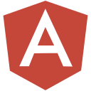
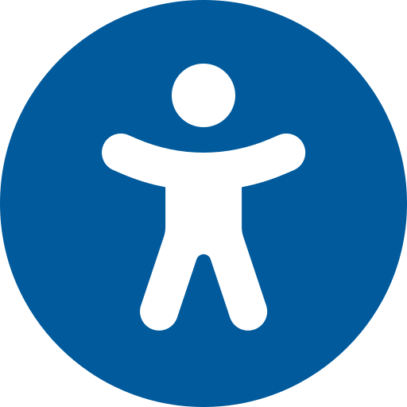
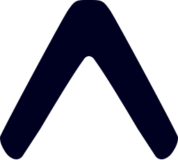
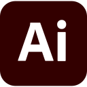
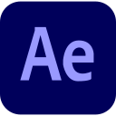

  <!-- Stylish Waving Header with Name -->
  

   

  <!-- Badges Row Including High-Contrast Profile Views Badge -->
  

    
    
    
    
    
    
    
  

 

  
<h2>Frontend & UI Systems</h2>

   
  

     &nbsp;
     &nbsp;
     &nbsp;
     &nbsp;
     &nbsp;
     &nbsp;
     &nbsp;
     &nbsp;
     &nbsp;
     &nbsp;
     &nbsp;
     &nbsp;
     &nbsp;
     &nbsp;
     &nbsp;
     &nbsp;
     &nbsp;
     &nbsp;
     &nbsp;
     &nbsp;
     &nbsp;
     &nbsp;
     &nbsp;
     &nbsp;
     &nbsp;
     &nbsp;
    
  

  <h3>State & UI Tools</h3>
  
<b>TanStack Query • Zustand • Redux • React Router • React Hook Form • Shadcn UI • Mantine • GSAP • Canvas API • Vite • Bootstrap • Bulma • Material UI • a11y • i18n</b>

 

  
<h2>Backend & API Architecture</h2>

   
  

     &nbsp;
     &nbsp;
     &nbsp;
     &nbsp;
     &nbsp;
     &nbsp;
     &nbsp;
     &nbsp;
     &nbsp;
     &nbsp;
     &nbsp;
     &nbsp;
     &nbsp;
     &nbsp;
    
  

  <h3>Protocols & CMS</h3>
  
<b>REST APIs • GraphQL • WebSockets • JWT Auth • Zod • Yup • Directus • Strapi • Stream.io</b>

 

  
<h2>Database & ORM</h2>

   
  

     &nbsp;
     &nbsp;
     &nbsp;
     &nbsp;
     &nbsp;
     &nbsp;
    
  

  <h3>ORMs & ODMs</h3>
  
<b>Prisma ORM • Mongoose • Relational RDBMS • Document Store • In-Memory Cache</b>

 

  
<h2>DevOps, Testing & Mobile</h2>

   
  

     &nbsp;
     &nbsp;
     &nbsp;
     &nbsp;
     &nbsp;
     &nbsp;
     &nbsp;
     &nbsp;
     &nbsp;
     &nbsp;
     &nbsp;
     &nbsp;
     &nbsp;
     &nbsp;
     &nbsp;
     &nbsp;
    
  

  <h3>Quality & Mobile</h3>
  
<b>Jest • Karma • Jasmine • SonarQube • React Native • Expo Router • Azure DevOps Pipelines • ESLint • Prettier • Vercel</b>

 

  
<h2>Creative & Multi-Media</h2>

   
  

     &nbsp;
     &nbsp;
     &nbsp;
     &nbsp;
    
  

  <h3>Design & VFX</h3>
  
<b>UI/UX Prototyping • Vector Graphics • Digital Raster Art • Video Editing • Motion Graphics</b>

 

---

### Featured Repositories

| Project | Description | Tech Stack | Repository |
| :--- | :--- | :--- | :---: |
| GloboTalk | Real-time language exchange & social networking platform with WebSockets & video calling | `React` `Node.js` `Express` `Stream.io` `Zustand` | [View Repo](https://github.com/ShahbaazX786/globotalk) |
| Media.ai | All-in-one Generative AI platform for text, image, audio & video generation | `Next.js` `GenAI` `TypeScript` `Tailwind` | [View Repo](https://github.com/ShahbaazX786/media.ai) |
| rePix | High-performance client-side image converter powered by Canvas API & Web Workers | `JavaScript` `Canvas API` `Web Workers` | [View Repo](https://github.com/ShahbaazX786/rePix) |
| Pexels Wallpaper | Cross-platform wallpaper discovery app built with curated collections | `React Native` `Expo Router` `TypeScript` | [View Repo](https://github.com/ShahbaazX786/pexels) |

---

### GitHub Streak Stats

  <!-- Light/Dark Mode Native Adaptive Streak Stats -->
  <picture>
    <source media="(prefers-color-scheme: dark)" srcset="https://github-readme-streak-stats.herokuapp.com/?user=shahbaazx786&theme=dark&hide_border=true&background=0D1117&stroke=38BDF8&ring=38BDF8&fire=38BDF8&currStreakNum=38BDF8&sideNums=C9D1D9&sideLabels=8B949E">
    <source media="(prefers-color-scheme: light)" srcset="https://github-readme-streak-stats.herokuapp.com/?user=shahbaazx786&theme=swift&hide_border=true">
    
  </picture>

